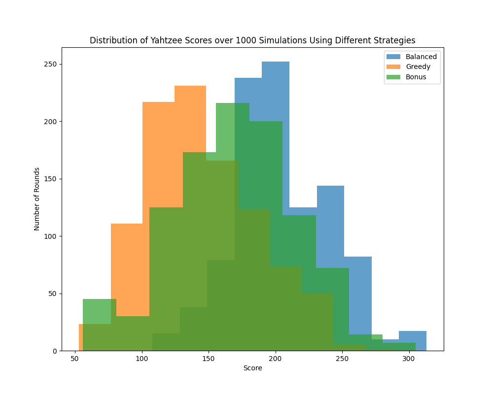
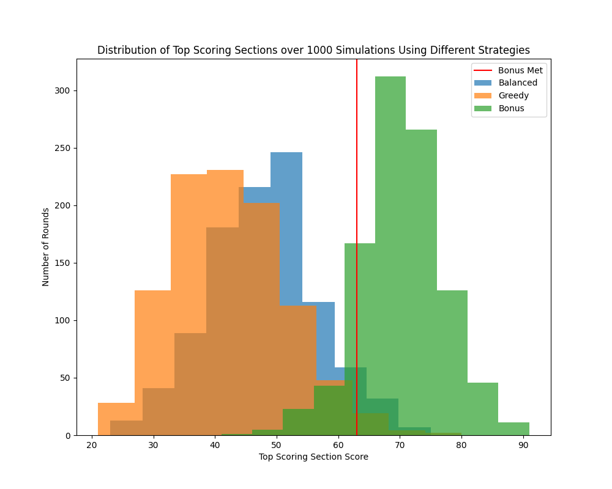

# Yahtzee Strategy Simulation

**Monte Carlo simulation analyzing scoring strategies and expected value outcomes in the dice game Yahtzee.**

---

## Project Overview

This project evaluates the effectiveness of different **Yahtzee scoring strategies** using simulation and probability modeling.  
By running 1,000 simulated games per strategy, we analyzed how player decision logic impacts average scores, bonus achievement rates, and consistency.

The simulation was built to:
- Compare how strategic approaches affect performance  
- Visualize score distributions across multiple play styles  
- Demonstrate applied **expected value modeling** and **Monte Carlo methods** in Python  

---

## Features

- **Simulates 13-round Yahtzee gameplay** under official rules  
- Evaluates three strategies: Greedy, Balanced, and Bonus-First  
- **Expected value–based decision-making** for optimal scoring choices  
- Tracks overall scores, upper-section performance, and bonus rates  
- Generates clear, data-driven visualizations of scoring distributions  

---

## Technology Stack

- **Python (Jupyter Notebook)** – Core simulation and analysis  
- **NumPy + itertools** – Probabilistic modeling and dice roll logic  
- **Matplotlib** – Visualization of score distributions  
- **Monte Carlo Simulation** – 1,000 game runs per strategy  
- **Expected Value Modeling** – Optimal decision evaluation framework  

---

## Data & Methodology

Three distinct strategies were tested:

| Strategy | Description |
|-----------|--------------|
| **Greedy Strategy** | Always selects the category with the highest immediate payoff. |
| **Balanced Strategy** | Weighs short-term and long-term expected values for an optimized approach. |
| **Bonus-First Strategy** | Prioritizes securing the 35-point upper-section bonus early. |

Each strategy was simulated **1,000 times**, recording total scores and upper-section outcomes.  
Visualizations below illustrate score distributions and bonus achievements.

---

## Visualizations

**Score Distributions (All Strategies)**  

**Upper Section Scoring Distribution**  

The vertical line at **63 points** represents the threshold for earning the 35-point bonus.  
The *Bonus-First Strategy* consistently clears this benchmark, while *Balanced* and *Greedy* strategies exhibit more varied distributions.

---

## Authors

**Matthew Cheung**  
📧 [cheung12@msu.edu](mailto:cheung12@msu.edu)  
🔗 [LinkedIn](https://www.linkedin.com/in/cheung-matthew/)

**Dylan Riggs**  
📧 [driggs7@gatech.edu](mailto:driggs7@gatech.edu) 
